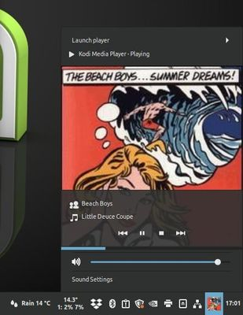

# Multimedia Player Remote Interfaces for Kodi

This Kodi addon provides a MPRIS interface for better integration of Kodi into Linux desktops.

[Version 1.0.8](https://github.com/wastis/LinuxAddonRepo)

It forwards the desktop- and keyboard multimedia control events to Kodi and provides meta data back to the desktop for display in system tray controls.

## Installation

This addon is included into the [Linux Addon Repository](https://github.com/wastis/LinuxAddonRepo). It is recommended to use the repository for the installation of the addon. This will ease version upgrades. 

## Testing Kodi MPRIS interface via command line

For simple command line control of Kodi the tool playerctl can be used. 

The following example requires Kodi up and running and the Multimedia Player Remote Interface addon installed and enabled in Kodi. 

**Install playerctl**

	sudo apt install playerctl	

**Check if Multimedia Player Remote Interface is up and running**

	playerctl -l

'tv.kodi.Kodi' needs to be in the output

**Open a media file**

	playerctl -p tv.kodi.Kodi open /path/to/file.mp3

**Open a playlist**

	playerctl -p tv.kodi.Kodi open /path/to/file.m3u

**Next**

	playerctl -p tv.kodi.Kodi next

**Seek 10s backwards**

	playerctl -p tv.kodi.Kodi position 10-

*2025 wastis*
